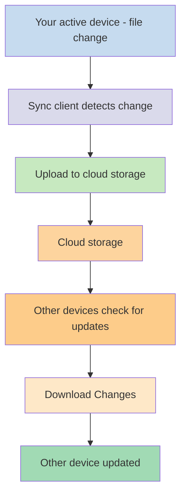
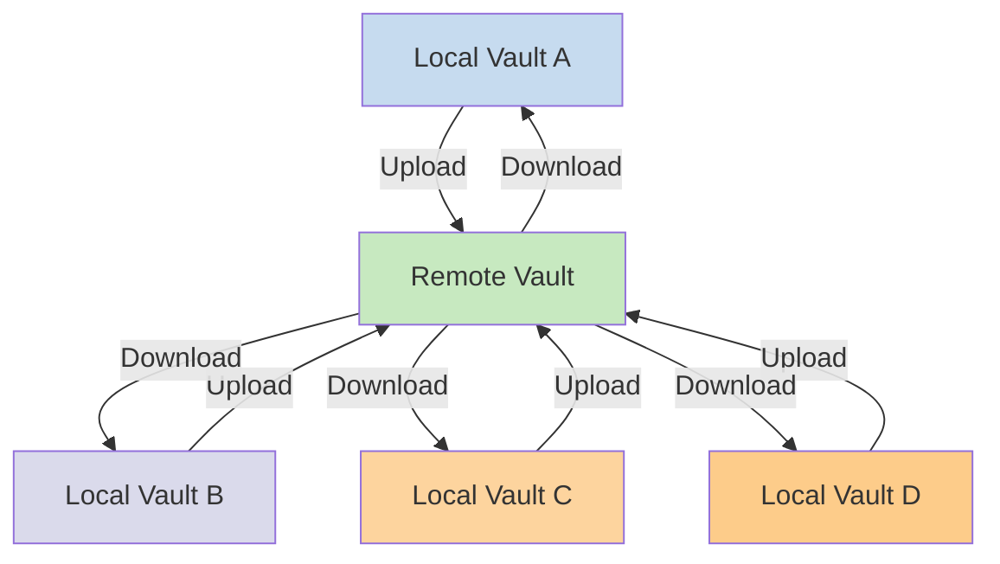

Source: https://help.obsidian.md/Obsidian+Sync/Local+and+remote+vaults
Title: Local and remote vaults - Obsidian Help
Fetched: 2026-08-23T20:02:50.325Z

[](https://obsidian.md/help/Home)[Obsidian Help](https://obsidian.md/help/Home)

English

- [English](https://obsidian.md/help/Obsidian+Sync/Local+and+remote+vaults)
- [العربية](https://obsidian.md/ar/help/Obsidian+Sync/Local+and+remote+vaults)
- [বাংলা](https://obsidian.md/bn/help/Obsidian+Sync/Local+and+remote+vaults)
- [Català](https://obsidian.md/ca/help/Obsidian+Sync/Local+and+remote+vaults)
- [Čeština](https://obsidian.md/cs/help/Obsidian+Sync/Local+and+remote+vaults)
- [Dansk](https://obsidian.md/da/help/Obsidian+Sync/Local+and+remote+vaults)
- [Deutsch](https://obsidian.md/de/help/Obsidian+Sync/Local+and+remote+vaults)
- [Ελληνικά](https://obsidian.md/el/help/Obsidian+Sync/Local+and+remote+vaults)
- [Español](https://obsidian.md/es/help/Obsidian+Sync/Local+and+remote+vaults)
- [فارسی](https://obsidian.md/fa/help/Obsidian+Sync/Local+and+remote+vaults)
- [Suomi](https://obsidian.md/fi/help/Obsidian+Sync/Local+and+remote+vaults)
- [Français](https://obsidian.md/fr/help/Obsidian+Sync/Local+and+remote+vaults)
- [עברית](https://obsidian.md/he/help/Obsidian+Sync/Local+and+remote+vaults)
- [Magyar](https://obsidian.md/hu/help/Obsidian+Sync/Local+and+remote+vaults)
- [Bahasa Indonesia](https://obsidian.md/id/help/Obsidian+Sync/Local+and+remote+vaults)
- [Italiano](https://obsidian.md/it/help/Obsidian+Sync/Local+and+remote+vaults)
- [日本語](https://obsidian.md/ja/help/Obsidian+Sync/Local+and+remote+vaults)
- [ខ្មែរ](https://obsidian.md/km/help/Obsidian+Sync/Local+and+remote+vaults)
- [한국어](https://obsidian.md/ko/help/Obsidian+Sync/Local+and+remote+vaults)
- [Nederlands](https://obsidian.md/nl/help/Obsidian+Sync/Local+and+remote+vaults)
- [Norsk](https://obsidian.md/no/help/Obsidian+Sync/Local+and+remote+vaults)
- [Polski](https://obsidian.md/pl/help/Obsidian+Sync/Local+and+remote+vaults)
- [Português](https://obsidian.md/pt/help/Obsidian+Sync/Local+and+remote+vaults)
- [Português (Brasil)](https://obsidian.md/pt-BR/help/Obsidian+Sync/Local+and+remote+vaults)
- [Română](https://obsidian.md/ro/help/Obsidian+Sync/Local+and+remote+vaults)
- [Русский](https://obsidian.md/ru/help/Obsidian+Sync/Local+and+remote+vaults)
- [Slovenčina](https://obsidian.md/sk/help/Obsidian+Sync/Local+and+remote+vaults)
- [Svenska](https://obsidian.md/sv/help/Obsidian+Sync/Local+and+remote+vaults)
- [ภาษาไทย](https://obsidian.md/th/help/Obsidian+Sync/Local+and+remote+vaults)
- [Türkçe](https://obsidian.md/tr/help/Obsidian+Sync/Local+and+remote+vaults)
- [Українська](https://obsidian.md/uk/help/Obsidian+Sync/Local+and+remote+vaults)
- [Tiếng Việt](https://obsidian.md/vi/help/Obsidian+Sync/Local+and+remote+vaults)
- [中文](https://obsidian.md/zh/help/Obsidian+Sync/Local+and+remote+vaults)
- [繁體中文](https://obsidian.md/zh-TW/help/Obsidian+Sync/Local+and+remote+vaults)
- No results

Getting started

Import notes

User interface

Editing and formatting

Linking notes and files

Files and folders

Plugins

Bases

Obsidian Publish

Obsidian Sync

[Introduction to Obsidian Sync](https://obsidian.md/help/sync)

[Local and remote vaults](https://obsidian.md/help/sync/vault-types)

[Set up Obsidian Sync](https://obsidian.md/help/sync/setup)

[Switch to Obsidian Sync](https://obsidian.md/help/sync/switch)

[Sync settings and selective syncing](https://obsidian.md/help/sync/settings)

[Version history](https://obsidian.md/help/sync/version-history)

[Status icon and messages](https://obsidian.md/help/sync/messages)

[Plans and storage limits](https://obsidian.md/help/sync/plans)

[Security and privacy](https://obsidian.md/help/sync/security)

[Collaborate on a shared vault](https://obsidian.md/help/sync/collaborate)

[Troubleshoot Obsidian Sync](https://obsidian.md/help/sync/troubleshoot)

[Frequently asked questions](https://obsidian.md/help/sync/faq)

[Sync regions](https://obsidian.md/help/sync/region)

[Upgrade Sync encryption](https://obsidian.md/help/sync/migrate)

[Headless Sync](https://obsidian.md/help/sync/headless)

Obsidian Web Clipper

Extending Obsidian

Contributing to Obsidian

Licenses and payment

Teams

Obsidian

[Help and support](https://obsidian.md/help/resources)

[Home](https://obsidian.md/help/)

[](https://obsidian.md/help/Home)[Obsidian Help](https://obsidian.md/help/Home)

EN

- [English](https://obsidian.md/help/Obsidian+Sync/Local+and+remote+vaults)
- [العربية](https://obsidian.md/ar/help/Obsidian+Sync/Local+and+remote+vaults)
- [বাংলা](https://obsidian.md/bn/help/Obsidian+Sync/Local+and+remote+vaults)
- [Català](https://obsidian.md/ca/help/Obsidian+Sync/Local+and+remote+vaults)
- [Čeština](https://obsidian.md/cs/help/Obsidian+Sync/Local+and+remote+vaults)
- [Dansk](https://obsidian.md/da/help/Obsidian+Sync/Local+and+remote+vaults)
- [Deutsch](https://obsidian.md/de/help/Obsidian+Sync/Local+and+remote+vaults)
- [Ελληνικά](https://obsidian.md/el/help/Obsidian+Sync/Local+and+remote+vaults)
- [Español](https://obsidian.md/es/help/Obsidian+Sync/Local+and+remote+vaults)
- [فارسی](https://obsidian.md/fa/help/Obsidian+Sync/Local+and+remote+vaults)
- [Suomi](https://obsidian.md/fi/help/Obsidian+Sync/Local+and+remote+vaults)
- [Français](https://obsidian.md/fr/help/Obsidian+Sync/Local+and+remote+vaults)
- [עברית](https://obsidian.md/he/help/Obsidian+Sync/Local+and+remote+vaults)
- [Magyar](https://obsidian.md/hu/help/Obsidian+Sync/Local+and+remote+vaults)
- [Bahasa Indonesia](https://obsidian.md/id/help/Obsidian+Sync/Local+and+remote+vaults)
- [Italiano](https://obsidian.md/it/help/Obsidian+Sync/Local+and+remote+vaults)
- [日本語](https://obsidian.md/ja/help/Obsidian+Sync/Local+and+remote+vaults)
- [ខ្មែរ](https://obsidian.md/km/help/Obsidian+Sync/Local+and+remote+vaults)
- [한국어](https://obsidian.md/ko/help/Obsidian+Sync/Local+and+remote+vaults)
- [Nederlands](https://obsidian.md/nl/help/Obsidian+Sync/Local+and+remote+vaults)
- [Norsk](https://obsidian.md/no/help/Obsidian+Sync/Local+and+remote+vaults)
- [Polski](https://obsidian.md/pl/help/Obsidian+Sync/Local+and+remote+vaults)
- [Português](https://obsidian.md/pt/help/Obsidian+Sync/Local+and+remote+vaults)
- [Português (Brasil)](https://obsidian.md/pt-BR/help/Obsidian+Sync/Local+and+remote+vaults)
- [Română](https://obsidian.md/ro/help/Obsidian+Sync/Local+and+remote+vaults)
- [Русский](https://obsidian.md/ru/help/Obsidian+Sync/Local+and+remote+vaults)
- [Slovenčina](https://obsidian.md/sk/help/Obsidian+Sync/Local+and+remote+vaults)
- [Svenska](https://obsidian.md/sv/help/Obsidian+Sync/Local+and+remote+vaults)
- [ภาษาไทย](https://obsidian.md/th/help/Obsidian+Sync/Local+and+remote+vaults)
- [Türkçe](https://obsidian.md/tr/help/Obsidian+Sync/Local+and+remote+vaults)
- [Українська](https://obsidian.md/uk/help/Obsidian+Sync/Local+and+remote+vaults)
- [Tiếng Việt](https://obsidian.md/vi/help/Obsidian+Sync/Local+and+remote+vaults)
- [中文](https://obsidian.md/zh/help/Obsidian+Sync/Local+and+remote+vaults)
- [繁體中文](https://obsidian.md/zh-TW/help/Obsidian+Sync/Local+and+remote+vaults)
- No results

# Local and remote vaults

```yaml
aliases:
  - Local vaults
  - remote vaults
  - remote vault
  - local vault
cssclasses:
  - soft-embed
description: This page describes the differences between local and remote vaults in practice.
mobile: true
permalink: sync/vault-types
publish: true
```

If you want to use your notes on different devices, one of the options you have is to [Sync your notes across devices](https://obsidian.md/help/sync-notes). Obsidian offers one such service, [Obsidian Sync](https://obsidian.md/help/sync), that works differently than other syncing services, like [iCloud](https://obsidian.md/help/sync-notes#iCloud) and [OneDrive](https://obsidian.md/help/sync-notes#OneDrive).

Here are some key terms:

- A **vault** is a folder on your file system which contains notes and an `.obsidian` folder with Obsidian-specific configuration.
- A **local vault** is the copy of your vault that exists on each of your devices. When using sync services, you connect these local vaults to enable synchronization.
- A **remote vault** is centralized storage that local vaults connect to directly through Obsidian Sync.

There are two common approaches to syncing:

- **[File-based sync services](https://obsidian.md/help/sync/vault-types#File-based%20sync%20services)**: Local vaults must be in monitored folders, sync happens through the file system
- **[Remote vaults](https://obsidian.md/help/sync/vault-types#Obsidian%20Sync)**: Centralized storage that local vaults connect to directly through Obsidian

## File-based sync services

Services like Dropbox, Google Drive, iCloud, and OneDrive are folder-based. These services monitor specific folders and automatically sync any files placed within them. Files must be in the designated cloud-service folders to sync. With file-based sync services, your local vault acts as just another folder being monitored. There is no dedicated remote vault - instead, the cloud storage serves as a passthrough, copying files between local vaults on different devices.

The diagram below shows a simplified version of how these services work:



If the cloud service has background syncing, then some of these processes may be happening even when you are not actively using the applications to view the files. These services monitor specific folders and automatically sync any files placed within them. Files must be in the designated cloud-service folders to sync.

## Obsidian Sync

Obsidian Sync allows you to create a remote vault that serves as centralized storage through its [Obsidian Sync](https://obsidian.md/help/sync) service. This allows you to choose almost any folder on any of your devices to store your files - whether on an external hard drive, in `C:\`, or in App storage on Android.

However, we do have a list of recommended locations for your local vault if you also use [File-based sync services](https://obsidian.md/help/sync/vault-types#File-based%20sync%20services) on the same device - mainly, anywhere that is not in a [third-party syncing service](https://obsidian.md/help/sync/switch#Move%20your%20vault%20out%20of%20your%20third-party%20syncing%20service%20or%20cloud%20storage).

The diagram below shows a simplified version of how Obsidian Sync works:



The strength of this system becomes more apparent with more device types. [File-based sync services](https://obsidian.md/help/sync/vault-types#File-based%20sync%20services) can be implemented inconsistently across operating systems, and mobile devices have their own rules with how applications can be sandboxed and power throttled, which makes it much harder for traditional file-based services to work seamlessly.

With Obsidian Sync, the service handles synchronization directly through the application, providing consistent behavior regardless of device type or operating system limitations, while prioritizing keeping a local copy of your data as a [soft backup](https://obsidian.md/help/backup).

### Sync behavior

When you make changes to files in your local vault, Obsidian Sync detects these changes and uploads them to the remote vault. Other devices connected to the same remote vault will then download these changes and apply them to their local vaults. Obsidian Sync tracks changes at the file level and only transfers the files that have been modified, rather than syncing entire folders. This reduces bandwidth usage and sync time.

When conflicts occur or when you need to control which files sync, Obsidian Sync provides specific mechanisms to handle these situations:

### Conflict resolution

A conflict happens when you change the same file on two or more devices before they sync. For example, you edit a note on your computer. Before that change uploads, you also change the same note on your phone.

Conflicts happen more often when you work offline. There are more changes and longer time between syncs, which increases the chance of conflicts.

#### How Obsidian Sync handles conflicts

When Obsidian Sync finds a conflict, the result depends on the file type:

- **Markdown files**: Obsidian Sync merges the changes using Google's [diff-match-patch](https://github.com/google/diff-match-patch) algorithm.
- **Other file types**: For all other files, including canvases, Obsidian uses a "last modified wins" approach. The most recently modified version replaces earlier versions.

For conflicts in Obsidian settings, such as plugin settings, Obsidian Sync merges the JSON files. It applies keys from the local JSON on top of the remote JSON.

#### Conflict resolution options

Starting in Obsidian 1.9.7, you can choose how to handle conflicts. To configure this setting:

1. Open **[Settings](https://obsidian.md/help/settings)**.
2. In the sidebar, select **Sync**.
3. Under **[Conflict resolution](https://obsidian.md/help/sync/settings#Conflict%20resolution)**, choose your preferred option:

   - **Automatically merge** (default): Obsidian Sync combines all changes from different devices into a single file. This saves all edits, but it may sometimes create duplicate text or formatting problems. You will need to fix these manually.
   - **Create conflict file**: When Obsidian finds conflicting changes, it creates a separate conflict file instead of merging automatically. You can then review both versions and merge them yourself. This gives you full control over the final result.

Configure on all devices

Conflict resolution settings are device-specific. You must configure your preferred option on each of your devices. This ensures the same behavior across all your synced devices.

**Conflict file naming pattern**

When you use the "Create conflict file" option, Obsidian creates a new file with this naming pattern:

```
original-note-name (Conflicted copy device-name YYYYMMDDHHMM).md
```

For example, if a conflict happens in a note called `Meeting notes.md`, the conflict file might be named:

```
Meeting notes (Conflicted copy MyMacBook2 202411281430).md
```

The conflict file contains the changes from the device where the conflict was detected. The original file keeps the remote version. You can compare both files and manually merge the content.

Check the Sync log

To check when conflicts happened, open the [Sync log](https://obsidian.md/help/sync/messages#Sync%20activity%20log). Filter for "Merge Conflicts" or search for "Conflict".

### Exclude a folder from syncing

By default, Obsidian syncs all files and folders in your vault. To exclude a specific folder from syncing:

1. Open **[Settings](https://obsidian.md/help/settings) → Sync**.
2. Next to **Excluded folders**, select **Manage**.
3. Select the folder you want to exclude from the list.
4. Select **Done**.

To remove a folder from the exclusion list, select the  button next to the folder name.

#### Always excluded from sync

##### File recovery snapshots

The snapshots in the [File recovery](https://obsidian.md/help/plugins/file-recovery) plugin are not synced via Obsidian Sync, as snapshots are kept in the [Global settings](https://obsidian.md/help/data-storage#Global%20settings).

##### Hidden files and folders

Files and folders beginning with a `.` are treated as hidden and excluded from sync. The only exception is the vault's [configuration folder](https://obsidian.md/help/configuration-folder) (`.obsidian`), which does sync.

Common examples of hidden files and folders that are not synced:

- `.vscode`
- `.git`
- `.idea`
- `.gitignore`

##### Sync settings

Sync settings do not sync across devices. You need to configure them separately on each device as needed.

### Offline behavior

Changes made while offline are queued and sync automatically when your device reconnects to the internet and Obsidian is open. Your local vault remains fully functional during offline periods.

## Next steps

- [Set up Obsidian Sync](https://obsidian.md/help/sync/setup) to get started with remote vaults.
- [Switch to Obsidian Sync](https://obsidian.md/help/sync/switch) if you're currently using file-based sync and want to use Obsidian Sync.
- [Explore other sync options](https://obsidian.md/help/sync-notes) if you're still deciding.

Local and remote vaults

Not found

This page does not exist

Interactive graph

On this page

File-based sync services

Obsidian Sync

Sync behavior

Offline behavior

Next steps

[Powered by Obsidian Publish](https://publish.obsidian.md/)